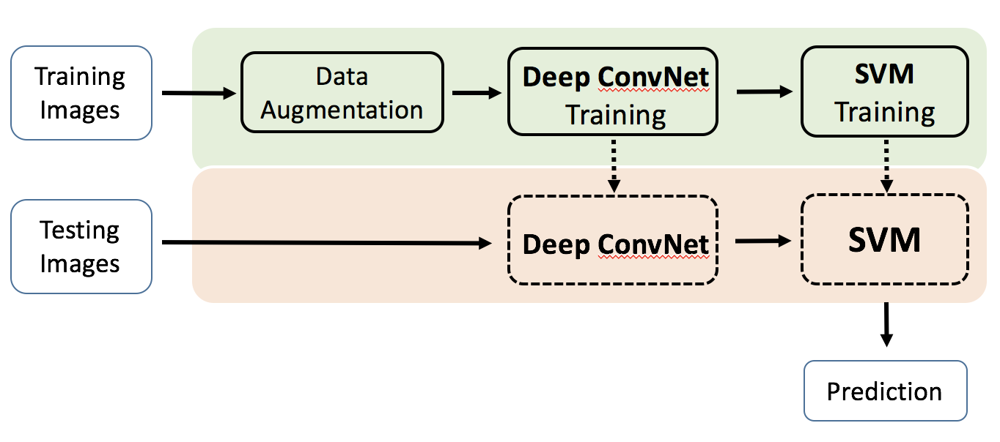
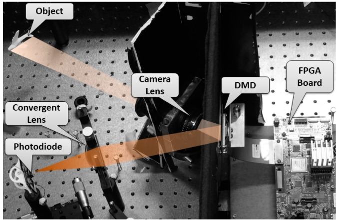
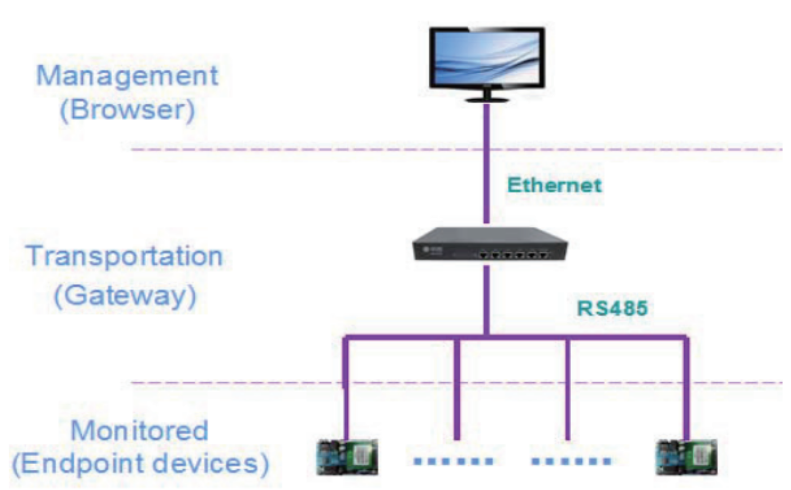

## About
My name is **Xiao Zeng**. I obtained my Ph.D degree in Michigan State University under the supervision of Prof. (Mi Zhang[[Link](https://www.egr.msu.edu/~mizhang/)]). I am an applied scientist at Amazon Lab126. 

## Projects

- MobileDeepPill: A Small-Footprint Mobile Deep Learning System for Recognizing Unconstrained Pill Images  
[[Video](https://www.youtube.com/watch?v=-k7awuoW2rg&feature=youtu.be)]
[[PDF](https://drive.google.com/file/d/0B58hocLyBTW0NWlXaGpyLUtLc0U/view?usp=sharing)]  
(1st Place in NIH 2016 Pill Recognition Challenge [[Link](https://www.nlm.nih.gov/news/pillimagerecognitionchallenge.html)])

- Deep Convolutional Neural Network for Fingerprint Pattern Classification  
[[Link](https://zengxiao1028.github.io/CSE902_Project_17Spring/)]  

- Compressive Video Recovery Using Block Match Multi-Frame Motion Estimation Based on Single Pixel Cameras  
[[Link](http://www.mdpi.com/1424-8220/16/3/318)]  

- Design and Implementation of a heterogeneous IOT gateway  
[[Link](http://journals.sagepub.com/doi/abs/10.1177/0142331214527600)]
[[Link](http://ieeexplore.ieee.org/xpls/icp.jsp?arnumber=639258)]  

## Contact

### Email
zenxiao@amazon.com

