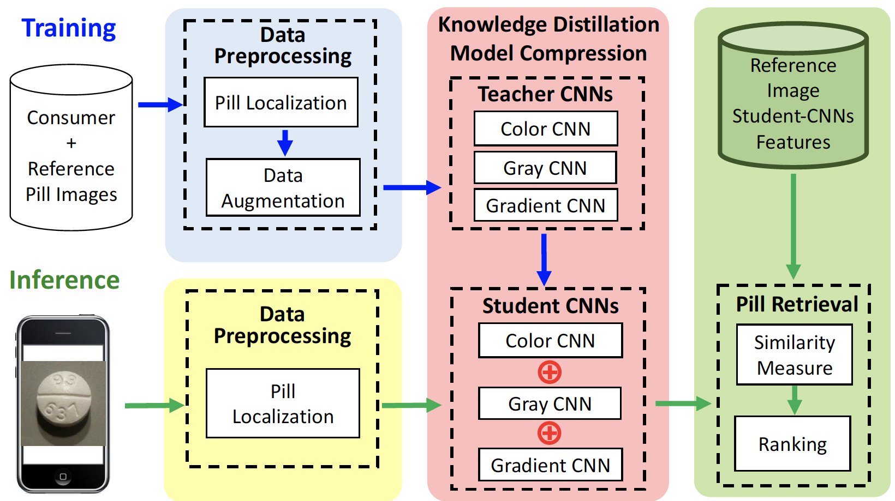

## About
My name is **Xiao Zeng**. I obtained my Ph.D degree in Michigan State University under the supervision of Prof. [Mi Zhang](https://www.egr.msu.edu/~mizhang/). My research interests include DNN Model Optimization, Federated Learning and Artificial Inlligence of Things (AIoT). I envision that the world of future is **connnected by distributed intelligence**. 

I am currently an applied scientist at Amazon Lab126, working on [Astro Project](https://www.aboutamazon.com/news/devices/meet-astro-a-home-robot-unlike-any-other), the first smart home robot.

## Projects

### Distributed Intelligence

### Deep Learnning Model Optimization

### Mobile Health

- MobileDeepPill: A Small-Footprint Mobile Deep Learning System for Recognizing Unconstrained Pill Images  
[[Video](https://www.youtube.com/watch?v=-k7awuoW2rg&feature=youtu.be)]
[[Paper](https://dl.acm.org/doi/pdf/10.1145/3081333.3081336)]
[[Patent](https://patentimages.storage.googleapis.com/7b/10/76/12f51f96eacc93/US10713540.pdf)]
(1st Place in NIH 2016 Pill Recognition Challenge [[Link](https://www.nlm.nih.gov/news/pillimagerecognitionchallenge.html)])

## Contact

### Email
zengxia6@msu.edu

